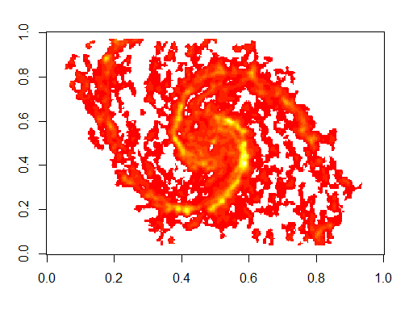

Hello,

My name is Qile Yang. I am a student in the MPS in Applied Statistics program and it is my first year here.

Last semester, I was in Machine Learning class, in which I learned Multinomial naive Bayes classifier and less naive bayes classifier. It was quite interesting to use Bayesian methods to classify spam emails in one of our homework. This experience aroused my interest in Bayesian data analysis. However, what I learned in Machine learning class was only a small part of BDA, and I want to have some systematic learning in this field. So I choose this class in this semester.

Also, I am doing an astronomy project with one of my classmate, Rahul and we believe that what we will learn in this class will be very helpful for our project. 

